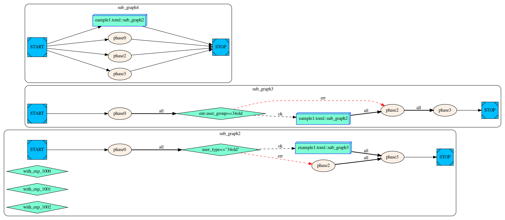

# Didagle
Dependency Injection Directed Acyclic Graph Lightweight Engine
<!-- TOC -->

- [Didagle](#didagle)
    - [算子](#算子)
    - [依赖注入DI](#依赖注入di)
    - [DAG](#dag)
        - [顶点](#顶点)
        - [边](#边)
            - [流程驱动](#流程驱动)
            - [数据驱动](#数据驱动)
    - [Didagle DSL](#didagle-dsl)
        - [GraphCluster](#graphcluster)
        - [Graph](#graph)
            - [流程驱动](#流程驱动-1)
            - [数据驱动](#数据驱动-1)
    - [Didagle执行引擎](#didagle执行引擎)

<!-- /TOC -->
## 算子
算子为基本执行单元，用cpp代码定义，包含如下元素：
- input成员变量，本质为const指针，代表输入， 可定义多个；
- output成员变量，本质为成员对象， 可定义多个；
- 初始化OnSetup方法， 算子对象生命周期内调用一次，可以不用重载定义；
- 重置OnReset方法， 算子对象生命周期内调用N次，执行引擎全任务执行完毕后执行，可以不用重载定义；
- 执行OnExecute方法，算子对象生命周期内调用N次
    - 返回0代表成功
    - 返回非0代表失败

```cpp
#include "processor_api.h"
//'phase0'为算子名称
GRAPH_OP_BEGIN(phase0) 
//GRAPH_OP_INPUT 定义算子输入，如'v0'为算子一个输入数据，为算子类的成员变量 
GRAPH_OP_INPUT(int, v0)
//GRAPH_OP_OUTPUT 定义算子输出， 'v1'为算子一个输出数据，为算子类的成员变量 
GRAPH_OP_OUTPUT(std::string, v1)
GRAPH_OP_OUTPUT((std::map<std::string, std::string>), v2)
// 初始化OnSetup方法
int OnSetup(const Params& args) override { return 0; }
// 重置OnReset方法
int OnReset() override { return 0; }
// 执行OnExecute方法
int OnExecute(const Params& args) override {
  // logic code
  return 0;
}
GRAPH_OP_END
```
## 依赖注入DI
这里的思想是将算子依赖的数据/资源以input成员变量形式定义在算子中，执行引擎会在算子执行前将各个算子的依赖注入到算子对象中；  
算子执行方法则无需主动获取依赖，直接使用input变量即可;    
算子的输出也会在执行完毕后自动发布到其它依赖改输出数据的算子对象上， 算子逻辑实现无需关注；  
如：
```cpp
#include "processor_api.h"
GRAPH_OP_BEGIN(phase2)
GRAPH_OP_INPUT(std::string, v1)
GRAPH_OP_OUTPUT(std::string, v5)
GRAPH_OP_OUTPUT((std::map<std::string, std::string>), v6)
int OnSetup(const Params& args) override { return 0; }
int OnExecute(const Params& args) override {
  if(nullptr != v1){
      //do sth for v1
  }
  // 逻辑修改赋值输出对象, 其它算子会得到改输出对象const指针
  v5 = "hello";
  v6["1"] = "1";
  return 0;
}
GRAPH_OP_END

GRAPH_OP_BEGIN(phase3)
// ‘phase2’的输出v5为‘phase3’的输入
GRAPH_OP_INPUT(std::string, v5)
// ‘phase2’的输出v6为‘phase3’的输入
GRAPH_OP_INPUT((std::map<std::string, std::string>), v6)
GRAPH_OP_OUTPUT(std::string, v100)
int OnSetup(const Params& args) override { return 0; }
int OnExecute(const Params& args) override {
  return 0;
}
GRAPH_OP_END
```

## DAG
这里DAG用于以图形式描述由一组算子对象完成的计算任务，这里分别讨论顶点和边：
### 顶点
一个顶点存在两种可能情况：
- 算子
- 子图Id（用于支持图嵌套调用）    

每个顶点执行结果只存在两种可能，成功或者失败；
每个顶点的出点有三种， 每个顶点通过其中一个出点与其它顶点相连，代表下一个顶点对于当前顶点执行结果依赖情况；  
- 成功的情况下
- 失败的情况下
- 所有的情况下

### 边
边为顶点间流向关系，一条边代表一个顶点执行完毕后将会开始执行另一侧的顶点； 这里存在两种描述边的途径：  
#### 流程驱动
通过顶点依赖关系直接描述边， 如 V(A) deps V(B) 或者 V(A) succeed V(B) 就可以描述A与B的边了；  
目前支持6种描述方式：  
- V(A) deps V(B) ， 任何情况下，执行完V(B)都会执行V(A)；
- V(A) deps_on_ok V(B) ， 执行完V(B)成功的情况下会执行V(A)；
- V(A) deps_on_err V(B)， 执行完V(B)失败的情况下会执行V(A)；
- V(A) succeed V(B)， 执行完V(A)，任何情况下都会执行V(B)；
- V(A) succeed_on_ok V(B)， 执行完V(A)，成功情况下都会执行V(B)；
- V(A) succeed_on_err V(B)， 执行完V(A)，失败情况下都会执行V(B)；

当算子存在条件执行的情况下，如`if(cond) -> A, else -> B`; 这里会将条件判断当作一种特殊算子，条件算子执行成功等同条件满足，相反就是条件不满足；  
- V(cond) succeed_on_ok V(A)
- V(cond) succeed_on_err V(B)

基于以上的规则，可以比较方便的构建一个完备的流程图DAG；基本上，这里的边描述规则和常规图数据描述SPO三元组类似，比较容易理解；
#### 数据驱动
流程驱动的描述方式优势是简单直接，比较直观；    
缺点是完全依赖人为定义顶点执行关系，可能造成并发度不够，如某个顶点可能可以提前执行，但被人为定义在后续某个阶段；在一个比较大的有多个顶点的执行图中，这个缺点会比较明显，依赖人工调整优化流程驱动DAG成本较高；       
这里引入一种基于数据驱动的图描述方式，原则上只需要定义顶点与顶点的输入、输出数据， 执行引擎会自动的基于数据的依赖推导出顶点依赖，继而构建一个完整的图；理论上构建出来的图的并行度是最高的。   
数据依赖的描述规则如下： 
- 顶点定义输入input
- 顶点定义输出output
- 输入输出是同一个数据定义，规则：
  - field， 代表在前述算子定义中的变量名
  - id， 默认为空，等同field； 若存在多个算子定义同名的输出变量时，需要配置id以消除同名
  - extern，作用与input输入， 默认false， 为true意味着该数据为外部非图中其它算子设置
  - required，作用与input输入， 默认false， 为true意味着该数据为必须依赖

边的推导关系过程如下：
- 迭代每个顶点(A)的输入数据，找到该数据署于哪个顶点(B)的输出;
  - 若该数据required为true， 则 V(A) deps_on_ok V(B)
  - 否则 V(A) deps V(B)   

当算子存在条件执行的情况下，如`if(cond) -> A, else -> B`; 数据驱动的描述会将if/else声明成两个命名的bool数据值；如：  
- 图中定义with_cond, without_cond两个变量， 分别在满足条件下才会赋值；
- V(A)中定义一个required的input为with_cond
- V(B)中定义一个required的input为without_cond 

## Didagle DSL 
基于以上的设计规则，didagle中定义了一种由toml配置描述的DSL，格式说明如下：

### GraphCluster
一个toml文件为一组图集合，图集合的名字为toml文件名， 格式如下：
```toml
strict_dsl = true                      # 是否严格校验（判断算子processor是否存在）
default_expr_processor = "expr_phase"  # 默认表达式算子
[[config_setting]]                     # 全局bool变量设置，由`default_expr_processor`执行
name = "with_exp_1000"                 # 全局bool变量名
cond = 'expid==1000'                   # bool表达式
[[config_setting]]
name = "with_exp_1001"
cond = 'expid==1001'

[[graph]]                              # DAG图定义  
...
```
### Graph
一个图为一个完整的执行任务，这里分别描述流程驱动和数据驱动描述：
#### 流程驱动
```toml
[[graph]]
name = "sub_graph2"                     # DAG图名  
[[graph.vertex]]                        # 顶点  
processor = "phase0"                    # 顶点算子，与子图定义/条件算子三选一
#id = "phase0"                          # 算子id，大多数情况无需设置，存在歧义时需要设置; 这里默认id等于processor名
successor = ["test_34old"]              # 顶点后继顶点
args = {x=1,y="2",z=1.2}                # 顶点算子参数
[[graph.vertex]]
id = "test_34old"                       # 算子id，大多数情况无需设置，存在歧义时需要设置 
cond = 'user_type=="34old"'             # 条件算子表达式
if = ["subgraph_invoke"]                # 条件算子成功后继顶点
else = ["phase2"]                       # 条件算子失败后继顶点
[[graph.vertex]]
id = "subgraph_invoke"                  # 子图调用算子id
cluster = "eample1.toml"                # 子图集合名
graph = "sub_graph2"                    # 子图名
[[graph.vertex]]
processor = "phase2"
select_args = [
    { match = "with_exp_1000", args = { abc = "hello1", xyz = "aaa" } },    # 条件变量， 全局变量with_exp_1000为true时生效，顺序判断选择
    { match = "with_exp_1001", args = { abc = "hello2", xyz = "bbb" } },
    { match = "with_exp_1002", args = { abc = "hello3", xyz = "ccc" } },
]
args = { abc = "default", xyz = "default" }                                 # 默认变量， 条件变量选择失败时选择  
[[graph.vertex]]
processor = "phase3"
deps = ["subgraph_invoke", "phase2"]    # 算子依赖的算子集合             
```
以上流程驱动样例构建的可视图  

 

#### 数据驱动

隐式基于算子成员变量的推导：  
```toml
[[graph]]
# 若processor的成员名能自动关联无冲突，则配置无需定义input/output, 能自动关联
name = "auto_graph"
[[graph.vertex]]
processor = "phase0"
input = [{ field = "v0", extern = true }]   # 外部设置的变量需要显示标明extern，否则图解析时会判断依赖input不存在
args = { abc = "default", xyz = "zzz" }
[[graph.vertex]]
processor = "phase1"
[[graph.vertex]]
processor = "phase2"
[[graph.vertex]]
processor = "phase3"
```

显式的基于数据声明的推导：
```toml
[[graph]]
name = "sub_graph0"
[[graph.vertex]]
processor = "phase0"
input = [{ field = "v0", extern = true }]    # 算子extern输入
output = [{ field = "v1", id = "v1" }, { field = "v2" }]  # 算子两个输出
select_args = [
    { match = "with_exp_1000", args = { abc = "hello1", xyz = "aaa" } },
]
args = { abc = "default", xyz = "zzz" }
[[graph.vertex]]
processor = "phase1"
input = [{ field = "v2" }]
output = [{ field = "v3" }, { field = "v4" }]
[[graph.vertex]]
processor = "phase2"
input = [{ field = "v1" }]
output = [{ field = "v5" }, { field = "v6" }]
[[graph.vertex]]
processor = "phase3"
id = "phase3_0"
# 显示声明input数据
input = [
    { field = "v1" },
    { field = "v2" },
    { field = "v3" },
    { field = "v4" },
    { field = "v5" },
    { field = "v6" },
]
output = [{ field = "v100", id = "m0" }]
[[graph.vertex]]
processor = "phase3"
id = "phase3_1"
# input = ...  , 无需设置，隐式可以推导出和phase3_0配置一样效果
output = [{ field = "v100", id = "m1" }]     # 将field输出到数据m1
[[graph.vertex]]
#expect = 'user_type=="34old"'               # 当条件'user_type=="34old"'满足时该算子才会运行
expect_config = "with_exp_1002"              # 当全局bool变量with_exp_1002为true时，该算子才会运行
processor = "phase3"
id = "phase3_2"
# input = ...  , 无需设置，隐式可以推导出和phase3_0配置一样效果
output = [{ field = "v100", id = "m2" }]     # 将field输出到数据m2
[[graph.vertex]]
processor = "phase4"
input = [{ field = "v100", aggregate = ["m0", "m1", "m2"] }]   # 输入为m0,m1,m2的聚合， 用途将多个重复类型的不同数据聚合在一起
```
以上两个样例构建的可视图  

 

didagle执行引擎工作时时将隐式、显式两种机制结合在一起工作，显式的配置会覆盖隐式的推导；

## Didagle执行引擎
执行引擎比较轻量，只需要指定几个依赖即可，API定义如下：
```cpp
typedef std::function<void(int)> DoneClosure;
typedef std::function<void(void)> AnyClosure;
typedef std::function<void(AnyClosure&&)> ConcurrentExecutor;
struct GraphExecuteOptions {
  ConcurrentExecutor concurrent_executor;        //并发执行器
  std::shared_ptr<Params> params;                //外部动态参数， 默认空
};

class GraphManager {
 public:
  int Execute(const GraphExecuteOptions& options, std::shared_ptr<GraphDataContext> data_ctx,
              const std::string& cluster, const std::string& graph, DoneClosure&& done);
};
```
其中关键的地方在于`ConcurrentExecutor`实现，didagle中没有默认实现； 在实际应用中， 用户可以用线程池、协程来封装实现；    
图的执行规则遵循两组：
- 顶点
  - 每个顶点有初始化依赖计数， 初始化依赖计数为0的为起始顶点，可以多个
  - 当顶点的的依赖计数为0时，执行引擎可以启动执行该顶点；
  - 顶点执行完毕后，需要将顶点的后继依赖计数减去1
  - 顶点执行完毕后，同时将图的join计数减去1
- 图
  - 每个图初始化join计数，数目为整个图的定点数
  - 当图的join计数为0， 整个图执行完毕，通知调用者的done closure
